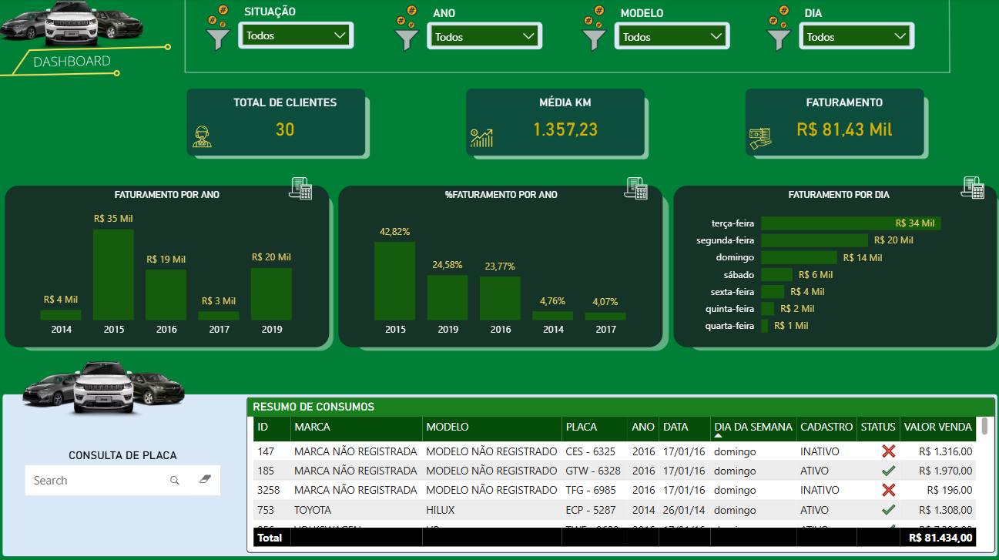
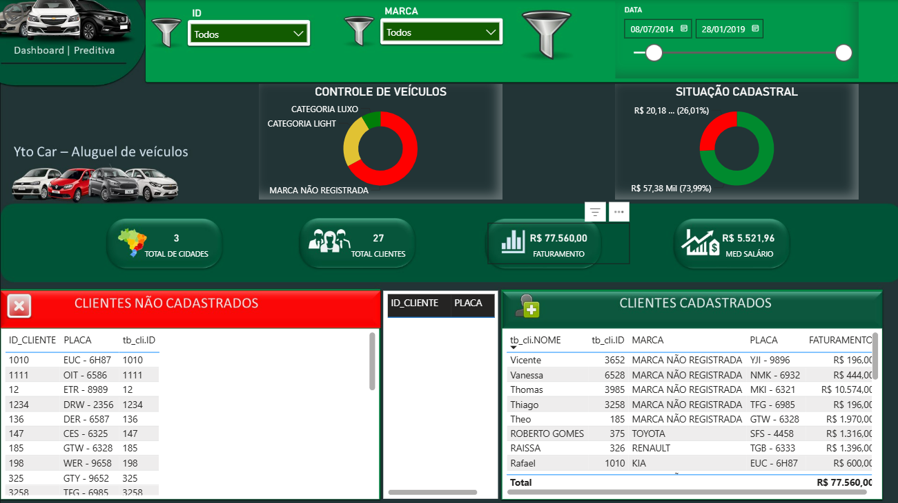
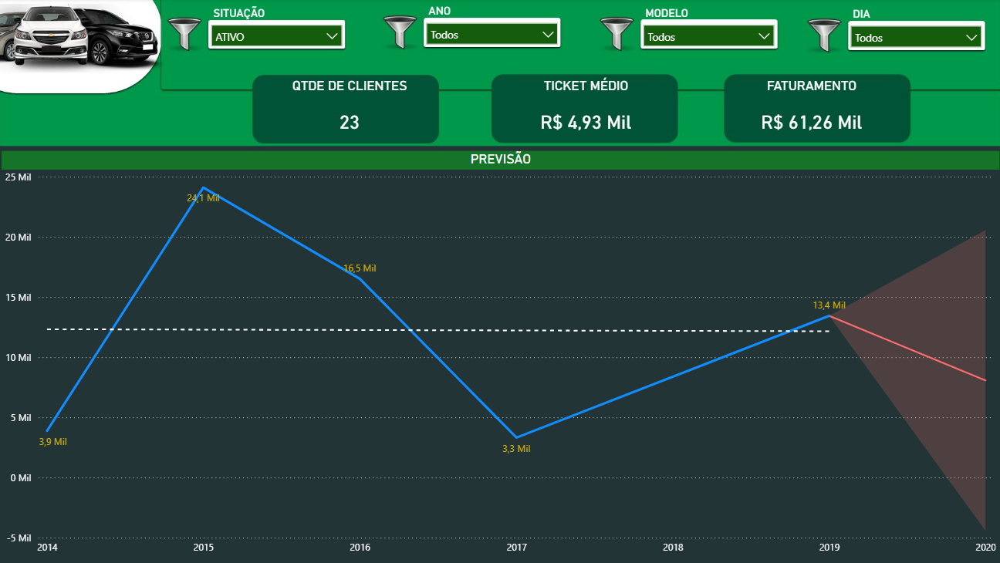
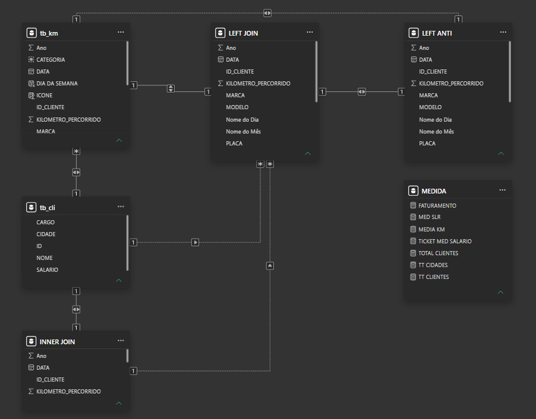
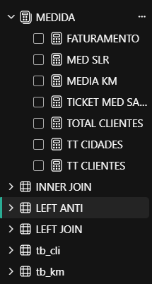

# Vehicle Rental Management — Dashboard Power BI

Dashboard de gestão para uma locadora de veículos fictícia (Yto Car), cobrindo faturamento, base de clientes, controle de frota e uma camada preditiva de vendas.

## 🎯 Objetivo
Centralizar indicadores operacionais e financeiros de uma locadora — faturamento, ticket médio, quilometragem e qualidade cadastral da base de clientes — além de projetar tendências futuras de faturamento.

## 📊 Fonte de dados
Dados fictícios da plataforma Kaggle criados para prática, simulando uma locadora de veículos (Yto Car) com operação em múltiplas cidades entre 2014 e 2019.

## 🛠️ Ferramentas
Power BI Desktop · DAX · Power Query (M) · Modelagem relacional (Inner Join, Left Join, Left Anti Join)

## 🖼️ Preview

## 🔗 Dashboard Interativo
[▶️ Clique aqui para explorar o dashboard ao vivo](https://app.powerbi.com/view?r=eyJrIjoiYzNjNTA1ZDctODRkNy00YzM3LThkOGItYWM1ODgyYTkzYWZjIiwidCI6IjY1NWFhNjFkLTVkY2ItNDE4Mi05N2YxLTJmNTQ5MTlkZTBjZiJ9)

## 🧩 Destaques técnicos
- **Modelagem relacional avançada**: uso combinado de Inner Join, Left Join e Left Anti Join entre as tabelas de clientes (`tb_cli`) e quilometragem (`tb_km`), isolando clientes cadastrados, não cadastrados e cruzamentos completos.
- **Tratamento de dados no Power Query**: padronização de inconsistências textuais (`Table.ReplaceValue`), como registros de marca/modelo não identificados, tratados como "MODELO NÃO REGISTRADO".
- **Tabela de medidas centralizada (DAX)**: KPIs reutilizáveis como Faturamento, Média KM, Ticket Médio, Total de Clientes e Total de Cidades, organizados numa tabela dedicada de medidas.
- **Busca dinâmica por placa**: campo de consulta interativo para localizar veículos específicos direto no dashboard.
- **Página preditiva**: projeção de tendência (forecast) sobre a série histórica de faturamento, com banda de incerteza visual.

## 💡 Principais insights
- Base de 30 clientes, com faturamento total de R$ 81,43 mil no período analisado
- 2015 foi o ano de pico, concentrando 42,82% de todo o faturamento (R$ 35 mil)
- Queda acentuada em 2017 (apenas 4,07% do faturamento), com recuperação parcial em 2019 (24,58%)
- Terça-feira é o dia de maior faturamento (R$ 34 mil), com queda progressiva ao longo da semana até quarta-feira (R$ 1 mil)
- 73,99% do faturamento (R$ 57,38 mil) vem de clientes com cadastro completo, indicando espaço para regularizar a base pendente (26,01%)
- Módulo preditivo aponta tendência de queda no faturamento entre 2019 e 2020 para o segmento de clientes ativos

## 📁 Estrutura
- Dashboard - LOCADORA DE VEICULO.pbix
- imagens/
- Dashboard interativo
- Destaques técnicos
- README.md

## 📬 Contato
[GitHub](https://github.com/RPessotti) · [LinkedIn](https://linkedin.com/in/rafael-pessotti-563240323)
